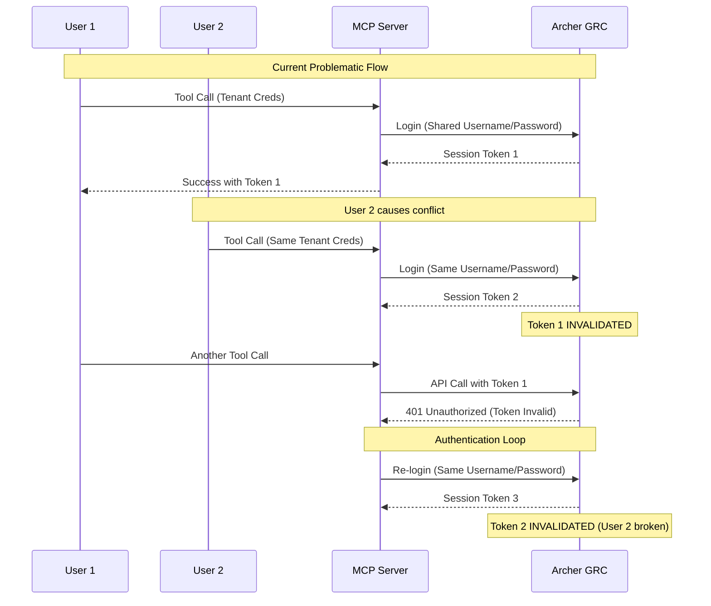
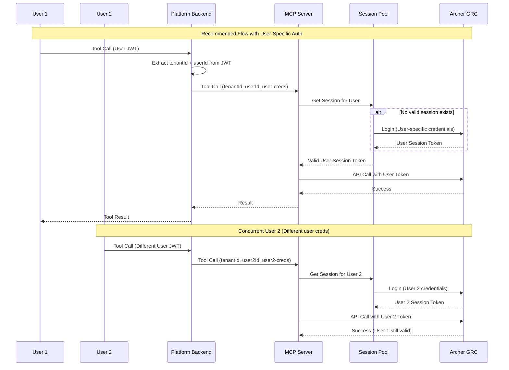
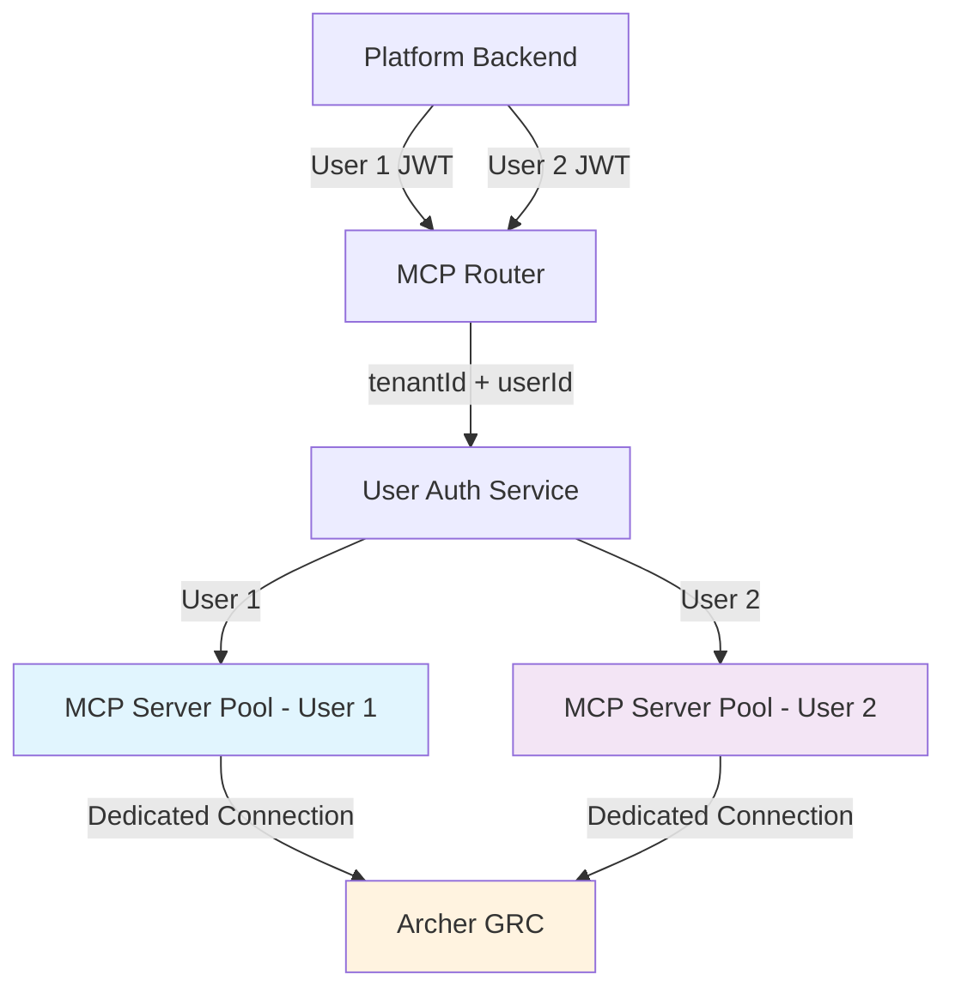

# Authentication Architecture Review and Recommendations

## Executive Summary

This document provides a comprehensive analysis of the current authentication architecture between MCP servers and external systems like Archer GRC, identifies critical security issues, and provides architectural recommendations for a secure, scalable multi-user, multi-tenant solution.

## Current Architecture Issues

### 1. **Critical Session Invalidation Problem**
**Issue**: Archer invalidates previous session tokens when a new authentication occurs, causing cascading failures in multi-user environments.

**Current Implementation**:
```typescript
// MCP Server (ArcherAPIClient)
async authenticate(): Promise<boolean> {
  const loginData = {
    InstanceName: this.instanceId,
    Username: this.username,
    UserDomain: this.userDomainId || '',
    Password: this.password
  };
  
  const response = await this.makeRequest<{SessionToken: string}>('/api/core/security/login', {
    method: 'POST',
    body: JSON.stringify(loginData)
  });
  
  if (response.IsSuccessful && response.RequestedObject?.SessionToken) {
    this.session = {
      sessionToken: response.RequestedObject.SessionToken,
      expiresAt: new Date(Date.now() + 20 * 60 * 1000) // 20 minutes
    };
  }
}
```

**Problem**: Each new authentication destroys existing sessions, causing race conditions when multiple users access the same tenant.

### 2. **Multi-User Conflict Scenarios**

| Scenario | Current Behavior | Impact |
|----------|------------------|---------|
| User A starts session at 10:00 | Creates session token ABC123 | ✅ User A can access Archer |
| User B starts session at 10:05 | Creates session token XYZ789, invalidates ABC123 | ❌ User A's session fails |
| User A retries operation at 10:06 | Creates session token DEF456, invalidates XYZ789 | ❌ User B's session fails |
| Authentication loops | Continuous token invalidation cycle | ❌ Both users locked out |

### 3. **Security Violations Against MCP Standards**

#### **Token Passthrough Anti-Pattern**
The current system violates MCP security best practices by using shared tenant credentials:

```typescript
// Current problematic pattern in MultiMcpClient
const credentials = await this.getExecutionCredentials(request);

// Execute the tool call
const result = await this.executeOnServer(serverDefinition, serverConfig, {
  toolName: request.toolName,
  arguments: {
    ...request.arguments,
    // ❌ VIOLATION: Using shared tenant credentials
    archer_connection: credentials
  },
  credentials
});
```

This creates the "confused deputy" problem described in the MCP security documentation.

#### **Missing User-Specific Context**
Current architecture lacks proper user isolation:
- No user-specific authentication flows
- No per-user credential management
- No audit trails linking actions to specific users

### 4. **Architecture Diagram - Current State**



## Root Cause Analysis

### 1. **Architectural Misalignment**
- **Designed for**: Single-user, single-tenant scenarios
- **Used for**: Multi-user, multi-tenant platform
- **Gap**: No consideration for concurrent user sessions

### 2. **Archer Platform Limitations**
Based on the Archer API documentation analysis:
- Session tokens are **user-specific**, not application-specific
- No support for multiple concurrent sessions per user
- No application-level authentication (only user-level)

### 3. **MCP Security Model Violation**
The current implementation violates several MCP security principles:
- **Token passthrough**: Using upstream tokens without proper validation
- **Shared credentials**: Multiple clients sharing the same authentication context
- **No audience validation**: Tokens not bound to specific MCP servers

## Recommended Architecture Solutions

### **Solution 1: User-Specific Authentication with Session Pooling**

#### Architecture Overview


#### Implementation Components

##### 1. **User-Specific Credential Store**
```typescript
interface UserCredentials {
  userId: string;
  tenantId: string;
  archerUsername: string;
  encryptedPassword: string;
  instanceId: string;
  instanceName: string;
  userDomainId: string;
  createdAt: string;
  lastUsed: string;
}

class UserCredentialsManager {
  async getUserCredentials(tenantId: string, userId: string): Promise<UserCredentials | null> {
    // Fetch user-specific Archer credentials from secure storage
    const result = await this.db.query(`
      SELECT * FROM user_archer_credentials 
      WHERE tenant_id = ? AND user_id = ? AND deleted_at IS NULL
    `, [tenantId, userId]);
    
    return result[0] || null;
  }
}
```

##### 2. **User-Specific Session Pool**
```typescript
interface UserSession {
  userId: string;
  tenantId: string;
  sessionToken: string;
  expiresAt: Date;
  lastUsed: Date;
}

class UserSessionPool {
  private sessions = new Map<string, UserSession>();
  
  async getValidSession(tenantId: string, userId: string): Promise<UserSession | null> {
    const key = `${tenantId}:${userId}`;
    const session = this.sessions.get(key);
    
    if (session && session.expiresAt > new Date()) {
      session.lastUsed = new Date();
      return session;
    }
    
    return null;
  }
  
  async createUserSession(tenantId: string, userId: string, credentials: UserCredentials): Promise<UserSession> {
    // Create new Archer session for this specific user
    const archerClient = new ArcherAPIClient({
      baseUrl: credentials.baseUrl,
      username: credentials.archerUsername,
      password: await this.decrypt(credentials.encryptedPassword),
      instanceId: credentials.instanceId,
      instanceName: credentials.instanceName,
      userDomainId: credentials.userDomainId
    });
    
    await archerClient.authenticate();
    
    const session: UserSession = {
      userId,
      tenantId,
      sessionToken: archerClient.getSessionToken(),
      expiresAt: new Date(Date.now() + 18 * 60 * 1000), // 18 minutes (buffer)
      lastUsed: new Date()
    };
    
    this.sessions.set(`${tenantId}:${userId}`, session);
    return session;
  }
}
```

### **Solution 2: Service Account with Impersonation Pattern**

If Archer supports service account authentication with user impersonation:

```typescript
class ServiceAccountAuthManager {
  private serviceAccountSession: ArcherSession | null = null;
  
  async authenticateServiceAccount(): Promise<void> {
    // Single service account for the tenant
    const serviceCredentials = await this.getServiceAccountCredentials();
    
    const archerClient = new ArcherAPIClient(serviceCredentials);
    await archerClient.authenticate();
    
    this.serviceAccountSession = archerClient.getSession();
  }
  
  async makeUserContextRequest(userId: string, endpoint: string, data: any): Promise<any> {
    if (!this.serviceAccountSession || !this.isSessionValid(this.serviceAccountSession)) {
      await this.authenticateServiceAccount();
    }
    
    // Add user context headers for impersonation/audit
    const headers = {
      'Authorization': `Archer session-id="${this.serviceAccountSession.sessionToken}"`,
      'X-Impersonate-User': userId,
      'X-Request-Context': JSON.stringify({ userId, timestamp: new Date().toISOString() })
    };
    
    return await this.makeArcherRequest(endpoint, data, headers);
  }
}
```

### **Solution 3: Connection-Per-User Model**

#### Architecture


## Best Practice Recommendations Based on MCP Security

### 1. **OAuth 2.1 Compliance for MCP Servers**

Based on the MCP Authorization specification, implement proper OAuth flows:

```typescript
// Recommended: OAuth-compliant MCP authentication
class OAuth2MCPServer {
  async authenticateClient(clientCredentials: ClientCredentials): Promise<AccessToken> {
    // Implement OAuth 2.1 authorization flow
    const authzServer = this.getAuthorizationServer();
    
    // Use PKCE for public clients
    const { codeVerifier, codeChallenge } = this.generatePKCE();
    
    // Include resource parameter for token binding
    const accessToken = await authzServer.exchangeAuthorizationCode({
      code: authzCode,
      codeVerifier,
      resource: this.getCanonicalMCPServerURI(),
      clientId: clientCredentials.clientId
    });
    
    return accessToken;
  }
  
  async validateToken(token: string): Promise<TokenClaims> {
    // CRITICAL: Validate token audience
    const claims = await this.verifyJWT(token);
    
    if (claims.aud !== this.getCanonicalMCPServerURI()) {
      throw new Error('Token audience validation failed');
    }
    
    return claims;
  }
}
```

### 2. **Prevent Token Passthrough Anti-Pattern**

```typescript
// ❌ WRONG: Token passthrough
async executeToolCall(request: McpToolExecutionRequest) {
  const upstreamToken = request.credentials.token;
  // Never pass upstream tokens directly to downstream services
  return await this.downstreamAPI.call(upstreamToken);
}

// ✅ CORRECT: Token exchange pattern
async executeToolCall(request: McpToolExecutionRequest) {
  // Validate incoming token for THIS MCP server
  const claims = await this.validateToken(request.token);
  
  // Use service-specific credentials for downstream
  const serviceCredentials = await this.getServiceCredentials(claims.tenantId);
  const downstreamToken = await this.authenticateWithDownstream(serviceCredentials);
  
  return await this.downstreamAPI.call(downstreamToken);
}
```

### 3. **User Context Preservation**

```typescript
interface AuthenticatedRequest {
  token: string;           // MCP server access token
  tenantId: string;       // From token claims
  userId: string;         // From token claims
  userContext: {
    email: string;
    roles: string[];
    permissions: string[];
  };
}

class UserContextualMCPServer {
  async executeToolCall(request: AuthenticatedRequest): Promise<ToolResult> {
    // Preserve user context throughout the call chain
    const userSession = await this.getUserSession(request.tenantId, request.userId);
    
    // Use user-specific Archer credentials
    const archerCredentials = await this.getUserArcherCredentials(request.tenantId, request.userId);
    
    // Execute with proper audit trail
    return await this.auditedExecute({
      tool: request.toolName,
      args: request.arguments,
      user: request.userId,
      tenant: request.tenantId,
      credentials: archerCredentials
    });
  }
}
```

## Multi-User Solution Design

### **Database Schema for User-Specific Credentials**

```sql
-- User-specific Archer credentials table
CREATE TABLE user_archer_credentials (
    id TEXT PRIMARY KEY,
    tenant_id TEXT NOT NULL,
    user_id TEXT NOT NULL,
    archer_username TEXT NOT NULL,
    encrypted_password BLOB NOT NULL,
    encryption_key_id TEXT NOT NULL,
    base_url TEXT NOT NULL,
    instance_id TEXT NOT NULL,
    instance_name TEXT,
    user_domain_id TEXT DEFAULT '1',
    is_active BOOLEAN DEFAULT TRUE,
    created_at TIMESTAMP DEFAULT CURRENT_TIMESTAMP,
    updated_at TIMESTAMP DEFAULT CURRENT_TIMESTAMP,
    last_used_at TIMESTAMP,
    last_success_at TIMESTAMP,
    failure_count INTEGER DEFAULT 0,
    last_failure_at TIMESTAMP,
    
    UNIQUE(tenant_id, user_id),
    FOREIGN KEY(tenant_id) REFERENCES tenants(id) ON DELETE CASCADE
);

-- Session pool for active user sessions
CREATE TABLE user_archer_sessions (
    id TEXT PRIMARY KEY,
    tenant_id TEXT NOT NULL,
    user_id TEXT NOT NULL,
    session_token TEXT NOT NULL,
    expires_at TIMESTAMP NOT NULL,
    created_at TIMESTAMP DEFAULT CURRENT_TIMESTAMP,
    last_used_at TIMESTAMP DEFAULT CURRENT_TIMESTAMP,
    is_active BOOLEAN DEFAULT TRUE,
    
    UNIQUE(tenant_id, user_id),
    FOREIGN KEY(tenant_id, user_id) REFERENCES user_archer_credentials(tenant_id, user_id) ON DELETE CASCADE
);

-- Audit trail for all authentication events
CREATE TABLE archer_auth_audit (
    id TEXT PRIMARY KEY,
    tenant_id TEXT NOT NULL,
    user_id TEXT NOT NULL,
    event_type TEXT NOT NULL, -- 'login', 'logout', 'session_refresh', 'auth_failure'
    archer_username TEXT NOT NULL,
    success BOOLEAN NOT NULL,
    error_message TEXT,
    ip_address TEXT,
    user_agent TEXT,
    session_id TEXT,
    timestamp TIMESTAMP DEFAULT CURRENT_TIMESTAMP
);
```

### **User Session Management Service**

```typescript
class UserSessionManager {
  private sessionPool = new Map<string, ArcherSession>();
  private authFailures = new Map<string, AuthFailureInfo>();
  
  async getOrCreateUserSession(tenantId: string, userId: string): Promise<ArcherSession> {
    const sessionKey = `${tenantId}:${userId}`;
    
    // Check for existing valid session
    let session = this.sessionPool.get(sessionKey);
    if (session && this.isSessionValid(session)) {
      await this.updateSessionUsage(session);
      return session;
    }
    
    // Check failure tracking to prevent lockouts
    if (this.isUserBlocked(sessionKey)) {
      throw new Error('User temporarily blocked due to authentication failures');
    }
    
    // Create new session
    try {
      const userCreds = await this.getUserCredentials(tenantId, userId);
      if (!userCreds) {
        throw new Error('No Archer credentials configured for user');
      }
      
      session = await this.authenticateUser(userCreds);
      this.sessionPool.set(sessionKey, session);
      
      // Clear any previous failure tracking
      this.authFailures.delete(sessionKey);
      
      // Audit successful authentication
      await this.auditAuthEvent({
        tenantId,
        userId,
        event: 'login',
        success: true,
        archerUsername: userCreds.archerUsername
      });
      
      return session;
      
    } catch (error) {
      this.trackAuthFailure(sessionKey);
      
      await this.auditAuthEvent({
        tenantId,
        userId,
        event: 'auth_failure',
        success: false,
        error: error.message
      });
      
      throw error;
    }
  }
  
  private isUserBlocked(sessionKey: string): boolean {
    const failure = this.authFailures.get(sessionKey);
    if (!failure) return false;
    
    // Block if too many failures within cooldown period
    const cooldownMs = 5 * 60 * 1000; // 5 minutes
    const maxFailures = 3;
    
    return failure.count >= maxFailures && 
           (Date.now() - failure.lastAttempt.getTime()) < cooldownMs;
  }
  
  private async authenticateUser(credentials: UserArcherCredentials): Promise<ArcherSession> {
    const client = new ArcherAPIClient({
      baseUrl: credentials.baseUrl,
      username: credentials.archerUsername,
      password: await this.decryptPassword(credentials.encryptedPassword),
      instanceId: credentials.instanceId,
      instanceName: credentials.instanceName,
      userDomainId: credentials.userDomainId
    });
    
    const success = await client.authenticate();
    if (!success) {
      throw new Error('Archer authentication failed');
    }
    
    return {
      sessionToken: client.getSessionToken(),
      expiresAt: new Date(Date.now() + 18 * 60 * 1000), // 18 min buffer
      userId: credentials.userId,
      tenantId: credentials.tenantId,
      lastUsed: new Date()
    };
  }
}
```

## Session Management Strategy

### **Session Lifecycle Management**

```typescript
class SessionLifecycleManager {
  private readonly SESSION_EXPIRY_BUFFER = 2 * 60 * 1000; // 2 minutes before Archer expiry
  private readonly CLEANUP_INTERVAL = 5 * 60 * 1000; // 5 minutes
  
  constructor() {
    this.startSessionCleanup();
    this.startHealthMonitoring();
  }
  
  async refreshSessionIfNeeded(session: ArcherSession): Promise<ArcherSession> {
    const timeToExpiry = session.expiresAt.getTime() - Date.now();
    
    if (timeToExpiry <= this.SESSION_EXPIRY_BUFFER) {
      console.log(`[Session Manager] Proactively refreshing session for user ${session.userId}`);
      return await this.refreshSession(session);
    }
    
    return session;
  }
  
  private async refreshSession(session: ArcherSession): Promise<ArcherSession> {
    const credentials = await this.getUserCredentials(session.tenantId, session.userId);
    
    // Create new authentication without invalidating until successful
    const newSession = await this.authenticateUser(credentials);
    
    // Update session pool atomically
    const sessionKey = `${session.tenantId}:${session.userId}`;
    this.sessionPool.set(sessionKey, newSession);
    
    await this.auditAuthEvent({
      tenantId: session.tenantId,
      userId: session.userId,
      event: 'session_refresh',
      success: true
    });
    
    return newSession;
  }
  
  private startSessionCleanup(): void {
    setInterval(async () => {
      const now = new Date();
      const expiredSessions: string[] = [];
      
      for (const [key, session] of this.sessionPool.entries()) {
        if (session.expiresAt <= now) {
          expiredSessions.push(key);
        }
      }
      
      expiredSessions.forEach(key => {
        this.sessionPool.delete(key);
      });
      
      if (expiredSessions.length > 0) {
        console.log(`[Session Manager] Cleaned up ${expiredSessions.length} expired sessions`);
      }
    }, this.CLEANUP_INTERVAL);
  }
}
```

## Implementation Roadmap

### **Phase 1: Foundation (Week 1-2)**

#### 1.1 Database Schema Updates
```bash
# Create migration script
npm run migration:create -- add-user-specific-credentials

# Apply schema changes
npm run migration:up
```

```sql
-- Migration: 001_add_user_credentials.sql
-- Add user-specific credential tables as defined above
```

#### 1.2 User Credential Management Service
- [ ] Create `UserCredentialsManager` class
- [ ] Implement secure password encryption/decryption
- [ ] Add user credential CRUD operations
- [ ] Create credential validation logic

#### 1.3 Authentication Failure Tracking
- [ ] Implement cooldown mechanism for failed attempts
- [ ] Add exponential backoff for retry logic
- [ ] Create audit trail for all authentication events

### **Phase 2: Session Pool Implementation (Week 3-4)**

#### 2.1 User Session Pool
```typescript
// File: src/services/userSessionPool.ts
export class UserSessionPool {
  // Implementation as defined above
}
```

#### 2.2 Session Lifecycle Management
- [ ] Implement proactive session refresh
- [ ] Add session cleanup routines
- [ ] Create session health monitoring
- [ ] Implement graceful session expiry handling

#### 2.3 Multi-User Archer Client Manager
```typescript
// Update: src/services/multiUserArcherClient.ts
class MultiUserArcherClientManager {
  async getClientForUser(tenantId: string, userId: string): Promise<ArcherAPIClient> {
    // Use user-specific credentials and sessions
    const session = await this.sessionPool.getOrCreateUserSession(tenantId, userId);
    return new ArcherAPIClient(session.credentials, session.sessionToken);
  }
}
```

### **Phase 3: MCP Integration Updates (Week 5-6)**

#### 3.1 Update MCP Server
```typescript
// Update: packages/mcp-server/src/server/index.ts
class GRCMCPServer {
  async handleCallTool(request: any): Promise<any> {
    // Extract user context from request
    const { tenantId, userId } = this.extractUserContext(request);
    
    // Use user-specific authentication
    const userClient = await this.clientManager.getClientForUser(tenantId, userId);
    
    // Execute tool with user context
    return await this.executeWithUserContext(userClient, request);
  }
}
```

#### 3.2 Platform Backend Updates
```typescript
// Update: src/services/multiMcpClient.ts
class MultiMcpClient {
  async executeToolCall(request: McpToolExecutionRequest): Promise<McpToolExecutionResult> {
    // Extract user ID from JWT token (already implemented in secure router)
    const userContext = this.extractUserFromJWT(request.token);
    
    // Pass user context to MCP server
    const enhancedRequest = {
      ...request,
      userContext: {
        tenantId: userContext.tenantId,
        userId: userContext.userId,
        email: userContext.email
      }
    };
    
    return await this.executeOnServer(serverDefinition, serverConfig, enhancedRequest);
  }
}
```

### **Phase 4: Security Hardening (Week 7-8)**

#### 4.1 MCP OAuth Compliance
- [ ] Implement proper token audience validation
- [ ] Add PKCE support for authorization flows
- [ ] Create resource-specific token binding
- [ ] Add token refresh mechanism

#### 4.2 Anti-Pattern Prevention
- [ ] Remove all token passthrough patterns
- [ ] Implement token exchange patterns
- [ ] Add comprehensive token validation
- [ ] Create secure credential forwarding

#### 4.3 Audit and Monitoring
```typescript
// Create: src/services/authenticationAuditor.ts
export class AuthenticationAuditor {
  async auditUserAuthentication(event: AuthAuditEvent): Promise<void> {
    // Log all authentication events
    // Track suspicious patterns
    // Generate compliance reports
  }
}
```

### **Phase 5: Testing and Validation (Week 9-10)**

#### 5.1 Multi-User Scenarios
- [ ] Test concurrent user sessions
- [ ] Validate session isolation
- [ ] Test session expiry handling
- [ ] Validate failure recovery

#### 5.2 Load Testing
```typescript
// Create: tests/load/multi-user-auth.test.ts
describe('Multi-User Authentication Load Test', () => {
  it('should handle 50 concurrent users per tenant', async () => {
    // Simulate multiple users making simultaneous requests
    // Validate no session conflicts occur
    // Ensure proper resource cleanup
  });
});
```

#### 5.3 Security Testing
- [ ] Penetration testing for session hijacking
- [ ] Token leakage validation
- [ ] Audit trail completeness verification
- [ ] Compliance validation (CPS230, ISO27001)

## Migration Strategy

### **Option A: Blue-Green Deployment**
1. Deploy new authentication system alongside existing
2. Route specific tenants to new system for testing
3. Gradually migrate all tenants
4. Decommission old system

### **Option B: Feature Flags**
```typescript
// Add feature flag for new authentication system
const useUserSpecificAuth = await this.featureFlags.isEnabled('user-specific-auth', tenantId);

if (useUserSpecificAuth) {
  return await this.newUserSessionManager.getSession(tenantId, userId);
} else {
  return await this.legacyCredentialsManager.getSession(tenantId);
}
```

### **Option C: Tenant-by-Tenant Migration**
1. Identify pilot tenant for testing
2. Migrate tenant's users to new system
3. Monitor for issues
4. Roll out to additional tenants

## Risk Mitigation

### **High-Risk Areas**
1. **Session Token Management**: Implement robust error handling
2. **User Credential Storage**: Use strong encryption and key management
3. **Concurrent Access**: Implement proper locking mechanisms
4. **Archer API Rate Limits**: Add request throttling and queuing

### **Rollback Plan**
- [ ] Maintain dual authentication systems during transition
- [ ] Create data migration rollback scripts
- [ ] Implement feature toggles for instant rollback
- [ ] Document emergency procedures

### **Monitoring and Alerting**
```typescript
// Create comprehensive monitoring
interface AuthMetrics {
  sessionCreationRate: number;
  sessionFailureRate: number;
  averageSessionDuration: number;
  concurrentUsers: number;
  archerApiLatency: number;
}

class AuthMonitor {
  async trackMetrics(): Promise<AuthMetrics> {
    // Collect and report authentication metrics
    // Alert on anomalies
    // Generate health reports
  }
}
```

## Success Criteria

### **Technical Metrics**
- [ ] Zero session conflict incidents
- [ ] < 1% authentication failure rate
- [ ] Session creation time < 2 seconds
- [ ] Support for 100+ concurrent users per tenant
- [ ] 99.9% uptime for authentication service

### **Security Metrics**
- [ ] Complete audit trail coverage
- [ ] Zero token passthrough incidents
- [ ] Compliance validation passes
- [ ] No unauthorized cross-user access

### **User Experience**
- [ ] Transparent user experience (no visible changes)
- [ ] No service interruptions during migration
- [ ] Improved reliability under load
- [ ] Faster response times

## Conclusion

The current authentication architecture has fundamental flaws that prevent it from supporting multi-user, multi-tenant scenarios. The recommended solution implements user-specific authentication with proper session isolation, following MCP security best practices.

Key benefits of the proposed architecture:
- **Eliminates session conflicts** between concurrent users
- **Improves security posture** with proper token validation
- **Enables proper audit trails** for compliance
- **Provides scalability** for growth
- **Maintains compatibility** with existing systems

The implementation requires careful planning and phased rollout, but will result in a robust, secure, and scalable authentication system that supports the platform's multi-tenant architecture.