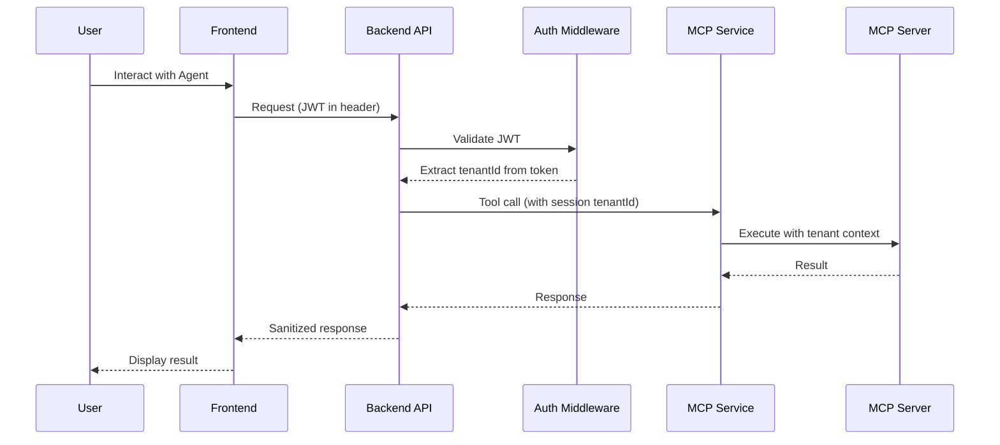

# Security Audit Report: MCP Tenant Context Handling

**Date:** 2025-08-28  
**Severity:** HIGH  
**OWASP Reference:** A01:2021 - Broken Access Control, A08:2021 - Software and Data Integrity Failures

## Executive Summary

Critical security vulnerability identified in the MCP (Model Context Protocol) integration where tenant IDs are being exposed in LLM prompts. This violates the principle of least privilege and creates potential for tenant isolation bypass attacks.

## Current Security Issues

### 1. CRITICAL: Tenant ID Exposed in System Prompt
**Location:** `/packages/frontend/src/lib/llmService.ts:226-230`

```typescript
// BAD: Tenant ID exposed to LLM
if (tenantId) {
  systemPrompt += `\n\n## IMPORTANT: Tenant Context
For all MCP tool calls, you MUST use the following tenant ID: ${tenantId}
This tenant ID should ALWAYS be provided in the "tenant_id" parameter when calling any MCP tools.
Never ask the user for the tenant ID - use this one: ${tenantId}`;
}
```

**Security Impact:**
- Violates principle of least privilege (OWASP A01:2021)
- LLM has unnecessary access to sensitive tenant context
- Risk of prompt injection attacks to extract tenant IDs
- Potential for cross-tenant data access if LLM is compromised
- Creates audit trail complications

### 2. Frontend Managing Tenant Context
**Location:** `/packages/frontend/src/lib/llmService.ts:473`

```typescript
// Frontend passing tenant ID to backend
const payload = {
  tenantId: tenantId,  // Should come from authenticated session
  // ...
};
```

**Security Impact:**
- Client-side tenant ID can be tampered with
- Bypasses server-side authorization checks
- Allows potential tenant spoofing attacks

### 3. Insufficient Backend Validation
**Location:** `/packages/backend/src/routes/mcp.ts:158-164`

While backend validates tenant ID format, it relies on frontend-provided values rather than authenticated session context.

## Secure Architecture Recommendation

### Design Principle: Zero Trust for Tenant Context

The tenant context should NEVER be exposed to the LLM or passed from the frontend. Instead, it should be:
1. Extracted from authenticated JWT tokens on the backend
2. Injected server-side into MCP tool calls
3. Validated at every layer of the stack

### Recommended Architecture Flow



## Implementation Security Requirements

### 1. Remove Tenant ID from LLM Prompts

**File:** `/packages/frontend/src/lib/llmService.ts`
```typescript
// REMOVE lines 226-230 completely
// Do NOT expose tenant context to LLM
private generateSystemPrompt(agent: AIAgent, agentConfig: AgentConfig): string {
  let systemPrompt = agent.systemPrompt;
  
  // Add orchestration guidance
  systemPrompt += orchestrationGuidance;
  
  // Add agent-specific extensions if configured
  if (agentConfig.promptTemplate) {
    systemPrompt += `\n\nSpecial Instructions:\n${agentConfig.promptTemplate}`;
  }
  
  // NO TENANT ID HERE
  return systemPrompt;
}
```

### 2. Backend Extracts Tenant from Authenticated Session

**File:** `/packages/backend/src/routes/mcp.ts`
```typescript
// Enhanced /call endpoint with session-based tenant extraction
mcpRouter.post('/call', authenticateToken, async (req, res) => {
  try {
    const authReq = req as AuthenticatedRequest;
    
    // SECURE: Extract tenant ID from authenticated session, NOT request body
    const tenantId = authReq.user.tenantId;  // From JWT token
    const userId = authReq.user.userId;
    
    // Validate request parameters (excluding tenantId)
    const { 
      toolName, 
      arguments: toolArgs,
      connectionId,
      agentId
    } = req.body;
    
    // SECURITY: Log any attempt to pass tenant ID in request
    if (req.body.tenantId && req.body.tenantId !== tenantId) {
      await auditLogger.logSecurityEvent({
        eventType: 'tenant_spoofing_attempt',
        userId,
        tenantId,
        details: {
          providedTenantId: req.body.tenantId,
          authenticatedTenantId: tenantId,
          toolName
        },
        clientIp: req.ip
      });
      
      return res.status(403).json({
        error: 'TENANT_CONTEXT_VIOLATION'
      });
    }
    
    // Execute with authenticated tenant context
    const result = await multiMcpClient.executeToolCall({
      toolName,
      arguments: toolArgs,
      tenantId,  // From session, not request
      userId,     // From session
      agentId,
      connectionId,
      enabledMcpServers: agentConfig.enabledMcpServers
    });
    
    return res.json(result);
  } catch (error) {
    // Error handling
  }
});
```

### 3. Frontend Removes Tenant ID from Requests

**File:** `/packages/frontend/src/lib/llmService.ts`
```typescript
private async callBackendMCPTool(
  toolName: string, 
  toolArgs: any, 
  archerConnection?: any,
  agent?: AIAgent
): Promise<any> {
  const payload = {
    toolName,
    arguments: toolArgs,
    connectionId: archerConnection.id,
    agentId: agent?.id,
    // DO NOT include tenantId - backend will extract from session
  };
  
  // Backend will use X-Tenant-ID header from authenticated session
  const response = await fetch(`${backendUrl}/mcp/call`, {
    method: 'POST',
    headers: {
      'Content-Type': 'application/json',
      // Auth token contains tenant context
      'Authorization': `Bearer ${getAuthToken()}`
    },
    body: JSON.stringify(payload)
  });
}
```

### 4. MCP Service Layer Security

**File:** `/packages/backend/src/services/multiMcpClient.ts`
```typescript
async executeToolCall(request: McpToolExecutionRequest): Promise<McpToolExecutionResult> {
  // SECURITY: Validate tenant context is from authenticated source
  if (!request.tenantId || !request.userId) {
    throw new Error('Tenant and user context required from authenticated session');
  }
  
  // SECURITY: Validate agent belongs to tenant
  const agentConfig = await agentConfigService.getAgentConfiguration(
    request.tenantId, 
    request.agentId
  );
  
  if (!agentConfig) {
    throw new Error('Agent not found or access denied');
  }
  
  // Inject tenant context server-side
  const enhancedArgs = {
    ...request.arguments,
    __tenant_context: {
      tenantId: request.tenantId,
      userId: request.userId,
      timestamp: new Date().toISOString()
    }
  };
  
  // Execute with injected context
  const result = await this.executeOnServer(
    serverDefinition,
    serverConfig,
    {
      toolName: request.toolName,
      arguments: enhancedArgs,
      credentials: request.credentials
    }
  );
  
  return result;
}
```

## Security Headers Configuration

Add these security headers to prevent tenant context leakage:

```typescript
// Security headers middleware
app.use((req, res, next) => {
  // Prevent caching of sensitive data
  res.setHeader('Cache-Control', 'no-store, no-cache, must-revalidate, private');
  res.setHeader('Pragma', 'no-cache');
  
  // Content Security Policy
  res.setHeader('Content-Security-Policy', 
    "default-src 'self'; " +
    "script-src 'self' 'unsafe-inline'; " +
    "style-src 'self' 'unsafe-inline'; " +
    "img-src 'self' data: https:; " +
    "connect-src 'self' https://api.grcplatform.com"
  );
  
  // Prevent clickjacking
  res.setHeader('X-Frame-Options', 'DENY');
  res.setHeader('X-Content-Type-Options', 'nosniff');
  
  // XSS Protection
  res.setHeader('X-XSS-Protection', '1; mode=block');
  
  // HSTS
  res.setHeader('Strict-Transport-Security', 
    'max-age=31536000; includeSubDomains; preload');
  
  next();
});
```

## Audit Logging Requirements

### Required Audit Events

1. **Tenant Context Validation**
```typescript
await auditLogger.logEvent({
  eventType: 'mcp_tool_execution',
  tenantId: authenticatedTenantId,
  userId: authenticatedUserId,
  details: {
    toolName,
    agentId,
    sessionId: req.sessionId,
    clientIp: req.ip
  }
});
```

2. **Tenant Spoofing Attempts**
```typescript
await auditLogger.logSecurityEvent({
  eventType: 'tenant_spoofing_attempt',
  severity: 'critical',
  tenantId: authenticatedTenantId,
  details: {
    attemptedTenantId: providedTenantId,
    endpoint: req.path,
    method: req.method
  }
});
```

3. **Cross-Tenant Access Attempts**
```typescript
await auditLogger.logSecurityEvent({
  eventType: 'cross_tenant_access_blocked',
  severity: 'high',
  details: {
    requestedResource: resourceId,
    resourceTenant: resourceTenantId,
    userTenant: authenticatedTenantId
  }
});
```

## Testing Security Scenarios

### Test Case 1: Tenant Spoofing Prevention
```typescript
describe('MCP Tenant Security', () => {
  it('should reject requests with mismatched tenant IDs', async () => {
    const response = await request(app)
      .post('/api/v1/mcp/call')
      .set('Authorization', `Bearer ${validToken}`)
      .send({
        toolName: 'get_records',
        tenantId: 'different-tenant-id',  // Spoofing attempt
        arguments: {}
      });
    
    expect(response.status).toBe(403);
    expect(response.body.error).toBe('TENANT_CONTEXT_VIOLATION');
  });
  
  it('should use tenant ID from JWT token', async () => {
    const response = await request(app)
      .post('/api/v1/mcp/call')
      .set('Authorization', `Bearer ${validToken}`)
      .send({
        toolName: 'get_records',
        arguments: {}
      });
    
    expect(response.status).toBe(200);
    // Verify the correct tenant was used
    expect(mockMcpClient.executeToolCall).toHaveBeenCalledWith(
      expect.objectContaining({
        tenantId: 'tenant-from-jwt'
      })
    );
  });
});
```

### Test Case 2: LLM Prompt Validation
```typescript
it('should not expose tenant ID in LLM prompts', () => {
  const llmService = new LLMService('test-tenant');
  const systemPrompt = llmService.generateSystemPrompt(mockAgent, {});
  
  // Ensure no tenant ID appears in prompt
  expect(systemPrompt).not.toContain('test-tenant');
  expect(systemPrompt).not.toContain('tenant_id');
  expect(systemPrompt).not.toContain('tenant ID');
});
```

## Compliance Checklist

- [ ] **CPS234 Compliance**: Tenant data isolation enforced at API layer
- [ ] **ISO 27001**: Access controls validated against authenticated session
- [ ] **SOC 2 Type II**: Audit trail for all tenant context operations
- [ ] **GDPR**: Data minimization - LLM has no access to tenant IDs
- [ ] **Zero Trust**: Every request validates tenant context from JWT

## Implementation Priority

1. **IMMEDIATE (P0)**: Remove tenant ID from LLM prompts
2. **HIGH (P1)**: Extract tenant from JWT in backend
3. **HIGH (P1)**: Add security event logging for violations
4. **MEDIUM (P2)**: Implement comprehensive test coverage
5. **MEDIUM (P2)**: Add security headers

## Risk Matrix

| Risk | Current Impact | After Fix | Mitigation |
|------|---------------|-----------|------------|
| Tenant ID Exposure to LLM | HIGH | NONE | Remove from prompts |
| Cross-Tenant Access | HIGH | LOW | Session-based validation |
| Prompt Injection | MEDIUM | NONE | No sensitive data in prompts |
| Audit Trail Gaps | MEDIUM | LOW | Comprehensive logging |
| Client-Side Tampering | HIGH | NONE | Server-side extraction |

## Recommended Security Tools Integration

1. **Runtime Application Self-Protection (RASP)**
   - Monitor for tenant context violations in real-time
   - Block suspicious MCP tool calls

2. **Web Application Firewall (WAF)**
   - Rule to block requests with tenant ID in body when header exists
   - Rate limiting per tenant

3. **Security Information and Event Management (SIEM)**
   - Alert on tenant spoofing attempts
   - Correlate cross-tenant access patterns

## Conclusion

The current implementation has a critical security flaw where tenant context is exposed to the LLM and managed client-side. The recommended approach extracts tenant context from authenticated JWT tokens server-side, ensuring proper isolation and preventing tenant spoofing attacks. This aligns with zero-trust principles and OWASP best practices for access control.

**Immediate Action Required:** Remove tenant ID from LLM prompts and implement server-side tenant context extraction from authenticated sessions.