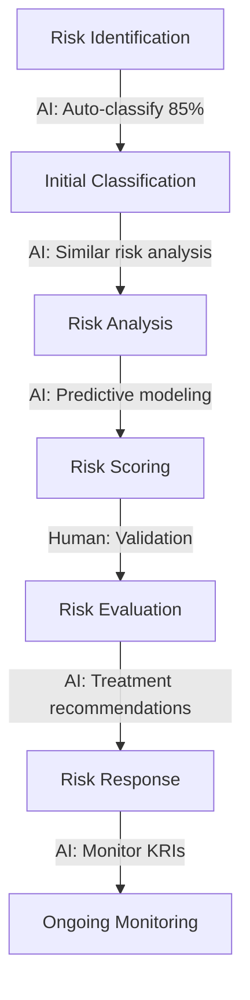

# Risk Management Framework for AI-Powered GRC Tools

## 1. Risk Framework Alignment

### Framework Integration Strategy

#### ISO 31000:2018 Alignment
- **Risk Identification**: AI classifies risks using ISO 31000 categories
- **Risk Analysis**: Automated likelihood × impact calculations
- **Risk Evaluation**: AI compares against risk appetite thresholds
- **Risk Treatment**: Recommendations based on 4T model (Treat, Transfer, Tolerate, Terminate)

#### COSO ERM Integration
- Map to 20 COSO principles across 5 components
- AI identifies control deficiencies per COSO criteria
- Automated assessment of entity-level vs. process-level controls

#### ISO 27001:2022 Compliance
- 93 controls across 4 themes (Organizational, People, Physical, Technological)
- AI maps incidents to Annex A controls
- Automated ISMS gap analysis

#### NIST Cybersecurity Framework
- Five functions: Identify, Protect, Detect, Respond, Recover
- AI maps controls to 108 subcategories
- Maturity scoring: Initial (1) to Optimized (5)

### Standard Risk Categories

```
OPERATIONAL RISKS
├── Process Failure (30-40% of incidents)
├── System Downtime (15-20%)
├── Human Error (25-35%)
├── Third-Party Failure (10-15%)
└── Project Delivery (5-10%)

FINANCIAL RISKS
├── Credit Risk
├── Market Risk
├── Liquidity Risk
├── Investment Risk
└── Budget Overrun

COMPLIANCE RISKS
├── Regulatory Non-Compliance
├── Policy Violations
├── Data Privacy Breaches
├── License Violations
└── Reporting Failures

STRATEGIC RISKS
├── Market Competition
├── Technology Disruption
├── Reputation Damage
├── M&A Integration
└── Business Model Obsolescence

CYBERSECURITY RISKS
├── Data Breach
├── Ransomware
├── Insider Threat
├── Supply Chain Attack
└── Zero-Day Exploits
```

### Risk Severity Levels

| Level | Score | Financial Impact | Operational Impact | Reputational Impact | Response Time |
|-------|-------|-----------------|-------------------|-------------------|---------------|
| Critical | 5 | >$10M or >5% revenue | Complete business disruption | International media coverage | <1 hour |
| High | 4 | $1M-$10M | Major process failure | National media coverage | <4 hours |
| Medium | 3 | $100K-$1M | Significant inefficiency | Industry publication coverage | <24 hours |
| Low | 2 | $10K-$100K | Minor inefficiency | Internal awareness only | <1 week |
| Negligible | 1 | <$10K | Minimal impact | No reputational impact | <1 month |

### Risk Appetite Statements

```yaml
risk_appetite:
  financial:
    statement: "Accept maximum 2% revenue impact from operational risks annually"
    threshold: 
      value: 2
      unit: "percentage_of_revenue"
      monitoring: monthly
    
  compliance:
    statement: "Zero tolerance for willful regulatory violations"
    threshold:
      critical_findings: 0
      high_findings: 3
      medium_findings: 10
      
  operational:
    statement: "Accept up to 99.5% system availability (43.8 hours downtime/year)"
    threshold:
      availability: 99.5
      mttr: 4  # hours
      mtbf: 720  # hours
      
  cyber:
    statement: "No more than 1 significant security incident per quarter"
    threshold:
      significant_incidents: 1
      data_records_exposed: 1000
      recovery_time: 24  # hours
```

## 2. Realistic Risk Scenarios

### Common Incident Types Requiring AI Classification

#### Data Privacy Incidents (35% of volume)
```json
{
  "incident_type": "Unauthorized Data Access",
  "frequency": "15-20 per month",
  "typical_causes": [
    "Misconfigured permissions (40%)",
    "Credential compromise (25%)",
    "Insider access abuse (20%)",
    "Third-party breach (15%)"
  ],
  "ai_classification_confidence": "85-95%",
  "regulatory_implications": ["GDPR Article 33", "CCPA breach notification"]
}
```

#### Operational Incidents (30% of volume)
```json
{
  "incident_type": "System Outage",
  "frequency": "8-12 per month",
  "typical_causes": [
    "Software deployment failure (30%)",
    "Infrastructure failure (25%)",
    "Configuration error (20%)",
    "Capacity issues (15%)",
    "Network issues (10%)"
  ],
  "ai_classification_confidence": "90-98%",
  "business_impact": "Revenue loss $10K-$500K per hour"
}
```

#### Compliance Violations (20% of volume)
```json
{
  "incident_type": "Policy Non-Compliance",
  "frequency": "5-8 per month",
  "typical_causes": [
    "Training gaps (35%)",
    "Process deviation (30%)",
    "System limitations (20%)",
    "Unclear requirements (15%)"
  ],
  "ai_classification_confidence": "75-85%",
  "remediation_cost": "$5K-$50K per incident"
}
```

### Emerging Risk Patterns AI Should Detect

1. **Supply Chain Vulnerability Clusters**
   - Pattern: Multiple vendors using same vulnerable component
   - Detection: Cross-reference vendor assessments with CVE databases
   - Risk Score Increase: 40-60% when pattern detected

2. **Regulatory Change Cascades**
   - Pattern: New regulation affecting multiple business processes
   - Detection: NLP analysis of regulatory updates + process mapping
   - Lead Time: 6-12 months before enforcement

3. **Insider Threat Indicators**
   - Pattern: Unusual access patterns + life events + sentiment changes
   - Detection: Behavioral analytics + HR data correlation
   - False Positive Rate: Target <5%

4. **Control Degradation Trends**
   - Pattern: Gradual decrease in control effectiveness over time
   - Detection: Statistical process control on KCI metrics
   - Alert Threshold: 2 standard deviations from baseline

### Common Control Gaps Found in Assessments

| Control Domain | Gap Frequency | Typical Root Cause | AI Detection Confidence |
|----------------|---------------|-------------------|-------------------------|
| Access Management | 78% | No regular access reviews | 92% |
| Change Management | 65% | Inadequate testing procedures | 88% |
| Incident Response | 62% | No defined escalation paths | 85% |
| Data Classification | 58% | Inconsistent labeling standards | 90% |
| Vendor Management | 55% | Missing risk assessments | 87% |
| Business Continuity | 52% | Outdated recovery procedures | 83% |
| Security Training | 48% | Generic content, not role-based | 80% |

## 3. Industry-Standard Metrics

### Risk Exposure Calculation

```python
# Inherent Risk Exposure (before controls)
inherent_risk_exposure = likelihood × impact × asset_value

# Residual Risk Exposure (after controls)
residual_risk_exposure = inherent_risk_exposure × (1 - control_effectiveness)

# Example Calculation:
# Cyber attack on customer database
inherent_risk = {
    'likelihood': 0.6,  # 60% chance annually
    'impact': 0.8,      # 80% of max impact
    'asset_value': 5000000,  # $5M customer data value
    'calculation': 0.6 * 0.8 * 5000000  # = $2.4M
}

residual_risk = {
    'control_effectiveness': 0.75,  # 75% effective controls
    'calculation': 2400000 * (1 - 0.75)  # = $600K
}
```

### Control Effectiveness Measurement

```yaml
control_effectiveness_matrix:
  design_effectiveness:
    weight: 40%
    scoring:
      - fully_designed: 100%
      - mostly_designed: 75%
      - partially_designed: 50%
      - poorly_designed: 25%
      - not_designed: 0%
      
  operational_effectiveness:
    weight: 60%
    components:
      - automation_level: 20%  # Manual=0%, Semi=50%, Full=100%
      - consistency: 20%       # Measured by standard deviation
      - coverage: 20%          # % of transactions covered
      - timeliness: 20%        # Within SLA percentage
      - accuracy: 20%          # Error rate inverse

example_control_score:
  control: "Privileged Access Management"
  design_score: 85
  operational_score: 72
  weighted_total: (85*0.4) + (72*0.6) = 77.2%
  rating: "Effective with Improvements Needed"
```

### Compliance Scoring Methodologies

#### Maturity-Based Scoring (CMMI Model)
```
Level 1 - Initial (0-20%): Ad-hoc, unpredictable
Level 2 - Managed (21-40%): Reactive, project-based
Level 3 - Defined (41-60%): Proactive, organization-wide
Level 4 - Quantified (61-80%): Measured and controlled
Level 5 - Optimizing (81-100%): Continuous improvement
```

#### Binary Compliance Scoring
```
Compliant = 1, Non-Compliant = 0
Compliance % = (Compliant Controls / Total Controls) × 100
Minimum Acceptable: 95% for SOX, 98% for PCI-DSS
```

#### Risk-Weighted Compliance Score
```
Score = Σ(Control_Weight × Compliance_Status) / Σ(Control_Weights)
Where weights are based on:
- Criticality (Critical=5, High=3, Medium=2, Low=1)
- Regulatory emphasis
- Business impact
```

## 4. Risk Management Workflows

### AI Insight Integration Points

#### Risk Assessment Workflow


### Risk Prioritization Matrix

| Risk Score | Velocity | Business Impact | Priority | Escalation Path |
|------------|----------|-----------------|----------|-----------------|
| >80 | Increasing | Critical Process | P1 - Immediate | Board → CEO → CRO |
| 60-80 | Stable | Important Process | P2 - High | CRO → Risk Committee |
| 40-60 | Increasing | Support Process | P3 - Medium | Risk Manager → Department Head |
| 20-40 | Stable | Support Process | P4 - Low | Risk Analyst → Team Lead |
| <20 | Decreasing | Any | P5 - Monitor | Automated monitoring only |

### Information Requirements by Audience

#### Board of Directors
- **Frequency**: Quarterly
- **Focus**: Strategic risks, top 10 risks, risk appetite breaches
- **Metrics**: Risk-adjusted returns, economic capital, compliance status
- **Format**: Heat maps, trend analysis, peer benchmarking

#### Risk Committee
- **Frequency**: Monthly
- **Focus**: Risk profile changes, emerging risks, control failures
- **Metrics**: KRI breaches, loss events, near-misses
- **Format**: Detailed dashboards, exception reports

#### Executive Management
- **Frequency**: Weekly
- **Focus**: Operational risks, project risks, incident status
- **Metrics**: Risk exposure by business unit, control effectiveness
- **Format**: Scorecards, action tracking

## 5. Practical Risk Data Points

### Risk Register Entry Example

```json
{
  "risk_id": "CYBER-2024-0042",
  "title": "Ransomware Attack on Production Systems",
  "category": "Cybersecurity",
  "subcategory": "Malware",
  "description": "Potential ransomware attack could encrypt production databases",
  "risk_owner": "Chief Information Security Officer",
  
  "inherent_risk": {
    "likelihood": 4,
    "impact": 5,
    "score": 20,
    "rating": "Critical"
  },
  
  "controls": [
    {
      "id": "CTRL-001",
      "name": "Endpoint Detection & Response",
      "effectiveness": 0.85,
      "type": "Detective"
    },
    {
      "id": "CTRL-002", 
      "name": "Immutable Backups",
      "effectiveness": 0.95,
      "type": "Corrective"
    },
    {
      "id": "CTRL-003",
      "name": "Network Segmentation",
      "effectiveness": 0.70,
      "type": "Preventive"
    }
  ],
  
  "residual_risk": {
    "likelihood": 2,
    "impact": 3,
    "score": 6,
    "rating": "Medium"
  },
  
  "risk_appetite_status": "Within Tolerance",
  "trend": "Increasing",
  "velocity": "High",
  
  "treatment_plan": {
    "strategy": "Treat",
    "actions": [
      "Implement zero-trust architecture",
      "Enhance backup testing frequency",
      "Deploy deception technology"
    ],
    "target_date": "2024-Q2",
    "investment": 250000
  },
  
  "kris": [
    {
      "name": "Backup test success rate",
      "current": 0.92,
      "target": 0.99,
      "threshold": 0.95
    },
    {
      "name": "Mean time to recover",
      "current": 4.2,
      "target": 2.0,
      "threshold": 4.0
    }
  ]
}
```

### Control Assessment Result

```json
{
  "assessment_id": "ASSESS-2024-Q1-015",
  "control_id": "AC-2",
  "control_name": "Account Management",
  "framework": "NIST 800-53",
  
  "design_assessment": {
    "score": 85,
    "gaps": [
      "No automated deprovisioning for contractors",
      "Privileged account inventory incomplete"
    ]
  },
  
  "operating_effectiveness": {
    "test_results": {
      "sample_size": 100,
      "exceptions": 8,
      "effectiveness_rate": 0.92
    },
    "root_causes": [
      "Manual process delays",
      "System integration gaps"
    ]
  },
  
  "maturity_level": 3,
  "last_assessment": "2023-10-15",
  "next_assessment": "2024-04-15",
  
  "remediation": {
    "priority": "High",
    "owner": "Identity Management Team",
    "target_date": "2024-05-31",
    "estimated_cost": 75000
  }
}
```

### Key Risk Indicators with Thresholds

```yaml
operational_kris:
  system_availability:
    current_value: 99.82%
    green_threshold: ">99.5%"
    amber_threshold: "99.0-99.5%"
    red_threshold: "<99.0%"
    measurement_frequency: "Real-time"
    
  incident_resolution_time:
    current_value: 3.2 hours
    green_threshold: "<4 hours"
    amber_threshold: "4-8 hours"
    red_threshold: ">8 hours"
    measurement_frequency: "Daily"

financial_kris:
  operational_loss_ratio:
    current_value: 0.018
    green_threshold: "<0.02"
    amber_threshold: "0.02-0.03"
    red_threshold: ">0.03"
    measurement_frequency: "Monthly"
    
compliance_kris:
  audit_finding_closure_rate:
    current_value: 87%
    green_threshold: ">90%"
    amber_threshold: "75-90%"
    red_threshold: "<75%"
    measurement_frequency: "Quarterly"

cyber_kris:
  phishing_click_rate:
    current_value: 2.3%
    green_threshold: "<3%"
    amber_threshold: "3-5%"
    red_threshold: ">5%"
    measurement_frequency: "Monthly"
```

## 6. AI Decision Support Guidelines

### Confidence Thresholds for Auto-Classification

```yaml
auto_classification_rules:
  critical_risks:
    minimum_confidence: 95%
    human_review: "Always required"
    auto_escalate: false
    
  high_risks:
    minimum_confidence: 90%
    human_review: "Required if confidence <93%"
    auto_escalate: true  # If confidence >93%
    
  medium_risks:
    minimum_confidence: 85%
    human_review: "Sample-based (10%)"
    auto_escalate: true  # If confidence >88%
    
  low_risks:
    minimum_confidence: 80%
    human_review: "Exception only"
    auto_escalate: true  # If confidence >80%
```

### Human Review Triggers

```python
requires_human_review = any([
    ai_confidence < threshold_for_risk_level,
    risk_score > 15,  # High inherent risk
    regulatory_implications == True,
    financial_impact > 100000,
    affects_critical_systems == True,
    anomaly_detected == True,
    historical_misclassification_rate > 0.05,
    new_risk_pattern == True,
    stakeholder_request == True
])
```

### AI Recommendation Presentation Format

```json
{
  "recommendation": {
    "action": "Implement additional control",
    "confidence": 88,
    "reasoning": {
      "primary_factors": [
        "Similar risks in peer organizations (weight: 35%)",
        "Cost-benefit analysis positive (weight: 30%)",
        "Regulatory expectation (weight: 20%)",
        "Trend analysis indicates increasing threat (weight: 15%)"
      ],
      "supporting_evidence": [
        "3 similar incidents in last quarter",
        "Control gap identified in recent audit",
        "Industry benchmark shows 95% adoption"
      ],
      "assumptions": [
        "Current control effectiveness remains stable",
        "Threat landscape continues current trend",
        "Budget availability for implementation"
      ]
    },
    "alternatives_considered": [
      {
        "action": "Accept risk",
        "confidence": 72,
        "reason_not_recommended": "Outside risk appetite"
      },
      {
        "action": "Transfer risk",
        "confidence": 65,
        "reason_not_recommended": "Insurance cost exceeds control cost"
      }
    ],
    "implementation_guidance": {
      "estimated_time": "6-8 weeks",
      "estimated_cost": "$45,000-$60,000",
      "resource_requirements": "2 FTEs for 6 weeks",
      "success_metrics": [
        "Control effectiveness >85%",
        "Zero critical findings in next audit"
      ]
    }
  }
}
```

### Trust-Building Features for Risk Professionals

1. **Explainability Dashboard**
   - Show decision tree for each classification
   - Highlight which factors had most weight
   - Provide confidence intervals
   - Display similar historical cases

2. **Audit Trail**
   - Every AI decision logged with inputs/outputs
   - Model version tracking
   - Override history with reasons
   - Performance metrics over time

3. **Feedback Loop**
   - One-click to flag incorrect classification
   - Quarterly model retraining with feedback
   - Show improvement metrics to users
   - Expert review panel for disputed cases

4. **Gradual Automation**
   - Start with recommendations only
   - Move to auto-classification with review
   - Graduate to full automation for high-confidence, low-risk items
   - Always maintain manual override capability